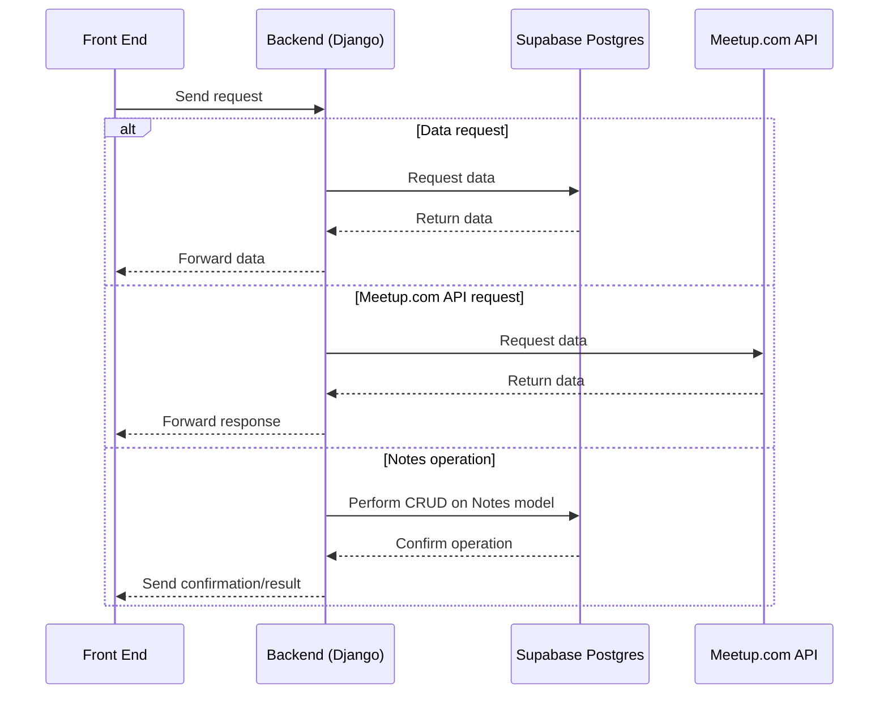

# Dearborn Coding Club Frontend
> A nice little website.

Dearborn Coding Club Frontend is a dynamic, React-based website for the [Dearborn Coding Club meetup group](https://www.meetup.com/dearborn-coding-club/).

## Table of Contents
1. [Architecture](#architecture)
2. [Environment Configuration](#environment-configuration)
3. [Running](#running)
    * [Running locally](#running-locally)
    * [Running from Docker Container](#running-from-the-gostatic-docker-container-locally)
4. [Building](#building-locally)
5. [Deploying](#deploying)
    * [Deploying to Fly.io](#deploying-to-flyio)
    * [Deploying to Staging](#deploying-to-staging)
6. [(Re)generating TLS Certificates](#regenerating-tls-certificates)

## Architecture
---

The entire architecture, currently, is as follows:



## Environment Configuration
---

The frontend uses environment variables to configure API endpoints for different environments. Create a `.env` file in the root directory with the following variables:

### Local Development

For local development, create a `.env` file with:

```bash
VITE_API_BASE_URL=http://localhost:8000
VITE_AUTH_SERVER_URL=http://localhost:8080
```

These are the default values used if the environment variables are not set, so you can run the app locally without a `.env` file.

### Production

For production builds, set these environment variables:

```bash
VITE_API_BASE_URL=https://api.dearborncodingclub.com
VITE_AUTH_SERVER_URL=https://auth.dearborncodingclub.com
```

> [!NOTE]
> Environment variables prefixed with `VITE_` are exposed to the client-side code. Make sure these only contain public API endpoints, not sensitive credentials.

## Running
---

### Running locally
- Run `npm install`
- (Optional) Create a `.env` file with your local configuration (see [Environment Configuration](#environment-configuration))
- Run `npm run dev`

### Running from the goStatic docker container locally
- Run `docker build . --tag frontend`
  - Builds the docker container with the static asset microservice.
- Run `docker run -p 8043:8043 frontend`
  - Runs the docker container locally with the server ports forwarded.

## Building
---

- Run `npm run build`

> [!NOTE]
> When building for production, ensure the environment variables `VITE_API_BASE_URL` and `VITE_AUTH_SERVER_URL` are set to production values. These are embedded at build time.

## Deploying
---

### Fly.io


We currently use [Fly.io](https://fly.io) as the managed service for hosting the website.

We deploy the site via GitHub Actions when a contributor merges a PR into the `main` branch. When deployed, CI initiates the `Fly Deploy` action, which builds the site and pushes it to Fly.io servers. The Fly.io server is pointed to by a CNAME record in our Squarespace account. The Squarespace account owns the purchased domain of https://dearborncodingclub.com, which our site is pointed to.
 
 ### Deploying to Fly.io

To deploy the application manually you must install the `flyctl` CLI tool. To install the `flyctl` plugin, follow the instructions available [here](https://fly.io/docs/flyctl/install/).
After `flyctl` has been installed, run `flyctl deploy` from the base directory, after logging in to an admin account locally (`flyctl auth login`).

### Deploying to Staging
We currently use AWS S3 buckets to host a staging environment (http://stage.dearborncodingclub.com) that is used for cloud testing before deploying to production. In order to leverage the staging environment, you must follow these steps:
1. Create a branch with working changes, of the naming pattern `feature/<feature-name>`, with `<feature-name>` being the name of the added feature.
2. Push the branch to the origin repository.
3. Create a pull request.
4. Wait for the `Upload Website` CI action to complete.
5. Observe your proposed changes in the staging environment (http://stage.dearborncodingclub.com).

## (Re)generating TLS Certificates
---

TLS certificates are used to validate HTTPS requests between browser clients and the servers that host our website. When the certificates become invalid after a predetermined expirations date, requests for the website will be flagged by the browser as insecure, and eventually blocked.

Dearborn Coding Club leverages [Fly.io](https://fly.io)'s CLI tooling to generate TLS certificates. Adding certificates to a new `dearborncodingclub.com` instance is done with the `fly certs add dearborncodingclub.com` command.

>[!NOTE] 
> Fly.io generated TLS certifications are valid for 90 days, and afterwards need to be regenerated.

[Fly.io](https://fly.io) handles our TLS certificates as part of their managed hosting service, though when an certificate is removed from the user interface we need to manually generated a Let's Encrypt certificate the `fly certs add dearborncodingclub.com` command.

