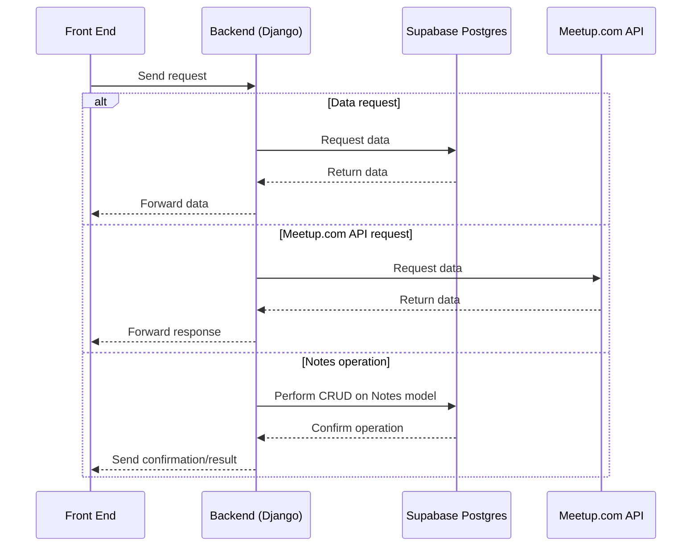

# React + TypeScript + Vite + Dearborn Coding Club

Check out the backend code [here](https://github.com/dearborn-coding-club/website-base-backend)

## Architecture
The entire architecture, currently, is as follows:

## Running locally
- Run `npm install`
- Run `npm run dev`

## Building locally
- Run `npm run build`

## Deploying to Fly.io
We currently use [Fly.io](https://fly.io) run the service.

We deploy the app via GitHub Actions whenever a PR merges into main (points to https://dearborncodingclub.com).
 
You can also deploy the application manually by executing `flyctl deploy` from the repo folder, after logging in to an admin account locally (`flyctl auth login`).
- You can install the `flyctl` CLI tool too.

## (Re)generating TLS Certificates
[Fly.io](https://fly.io) handles our TLS certificates as part of their managed hosting service. We have manually generated a Let's Encrypt certificate using:

`fly certs add dearborncodingclub.com`

## Running from the goStatic docker container locally
- Run `docker build . --tag frontend`
  - Builds the docker container with the static asset microservice.
- Run `docker run -p 8043:8043 frontend`
  - Runs the docker container locally with the server ports forwarded.