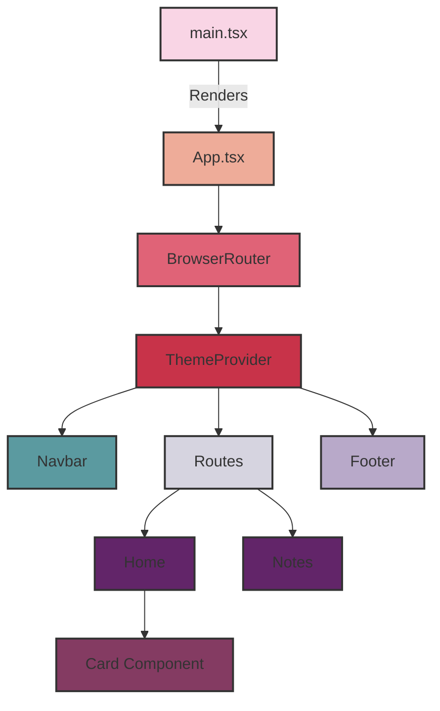

# Frontend Structure

Below is a diagram illustrating the structure of our frontend application:

## Diagram Explanation

- `main.tsx` is the entry point of our application.
- `App.tsx` is the main component that sets up the overall structure.
- We use `BrowserRouter` for handling routing in our application.
- `ThemeProvider` wraps our app to provide theming capabilities.
- `Navbar` and `Footer` are consistent across all pages.
- `Routes` component manages different page routes.
- `Home` and `Notes` are our main page components.
- `Card Component` is used within the `Home` page to display information.

The colors in the diagram represent different levels or types of components in our structure.